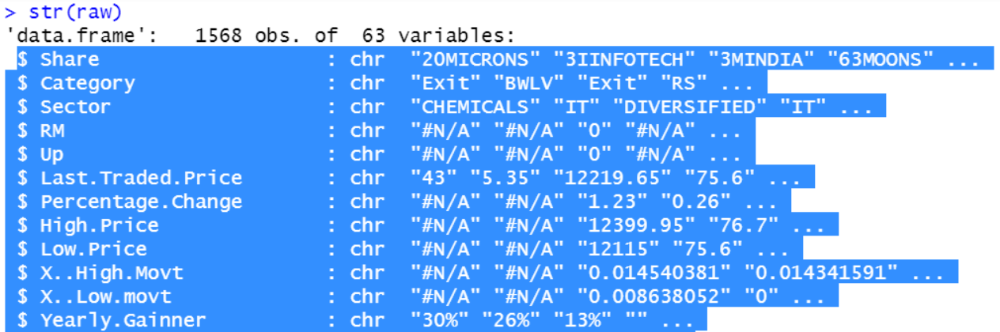

```{r setup, include=FALSE}
knitr::opts_chunk$set(echo = TRUE)
```

## Assignment

Choose any three of the “wide” datasets identified in the Week 5 Discussion items. (You may use your own dataset; please don’t use my Sample Post dataset, since that was used in your Week 6 assignment!) For each of the three chosen datasets:

* Create a .CSV file (or optionally, a MySQL database!) that includes all of the information included in the dataset. You’re encouraged to use a “wide” structure similar to how the information appears in the discussion item, so that you can practice tidying and transformations as described below.
* Read the information from your .CSV file into R, and use tidyr and dplyr as needed to tidy and transform your data. [Most of your grade will be based on this step!]
* Perform the analysis requested in the discussion item.

Your code should be in an R Markdown file, posted to rpubs.com, and should include
narrative descriptions of your data cleanup work, analysis, and conclusions. 

## Libraries
```{r}
library(stringr)
library(tidyr)
library(tidyverse)
library(dplyr)
library(ggplot2)

```

## Data Set 1 - Farhana Zahir: Untidy stock market data 

I mostly work with financial data and a very interesting dataset I came across is from the stock market of India at this link  https://www.kaggle.com/souravroy1/stock-market-data/download . The dataset contains 20 columns and is basically the trading data of the market on a single day. The columns contain the ticker, sector, the last traded price, high price, low price and a bunch of other price points and valuation metrics on that particular trading day. 

The structure of the data set is as follows:(only showing a few of the 63 variables)



As can be seen above, this is extremely untidy data with a lot of the prices being shown as character variables. There are also a lot of NAs in this file. I would first need to do a missing value analysis to determine what the variables that I can actually work with in this dataset. I would need to change the data types to appropriate, and since a lot of the variables can be derived from the other variables, I would try to use reformulate as much of the table as possible.

### Preliminary Look
**Let's first load the data into R and take a look at it.**
```{r}

stockData <- read.csv('Tidying_Data_StockMarket.csv', header = TRUE)
dim(stockData)
```


**We have 1568 records with 63 fields. Just by looking at the data types, we can see that the majority of the columns are stored as charactrers (even ones that should be numeric!) We can also see that there are quite a bit of fields that have a value of either #N/A or #REF.**


**This is quite a bit of data to work with, so let's first start by limiting it to a subset of the columns. I'm not very familiar with financial data, so we'll take the subset of columns according to the discussion from Farhana. Looks like all of the fields that were discussed are in columns 1 - 9. For fun, let's also take the Future column, because it's a categorical feature that might be interesting to look at across sectors. **

``` {r}

finalStocks <- stockData[,c(1:9,62)]

```

**Before we start looking at the data, let's convert all instances of #REF!, #N/A, and blank to NA. This will allow us to see which of these columns has enough meaningful records to analyze.**

```{r}

finalStocks[] <- lapply(finalStocks, function(x){
 levels(x)[levels(x) == "#N/A"| levels(x) == "#REF!"| levels(x) == ''] <- NA
 x
 })

```

**Now that we've converted our unknown data, let's take a look at the distribution of nulls in each column. To do this, we'll calculate the total number of null values in each column and divide that by the total number of records in the data set. **

```{r}

na_count <-sapply(finalStocks, function(y) sum(length(which(is.na(y)))))
na_count/dim(finalStocks)[1]

```

**Looks like we have 3 columns that have more than 50% null values. Let's subset our data once again to get rid of those. **

``` {r}

finalStocks <- subset(finalStocks, select = -c(RM,Up,Future) )

```

**Now that we have the columns we'd like to use, let's take one last look at the data types of each to see if they're formatted properly. We know that Share, Category, and Sector should all be string columns, and the rest should be numeric. We'll convert the columns that do not have the appropriate data type. **

```{r}

str(finalStocks)

numericCols <- c('Last.Traded.Price','Percentage.Change','High.Price','Low.Price')

finalStocks[numericCols] <- sapply(finalStocks[numericCols],as.character)
finalStocks[numericCols] <- sapply(finalStocks[numericCols],as.numeric)

```

**Almost done with the tidying! There's only one thing that's left. If we look at the Sector column, one of the levels is 0. Let's convert that to NA.**

```{r}
levels(finalStocks$Sector)[levels(finalStocks$Sector) == '0'] <- NA
```

### Analysis
**Since there was no discussion of an analysis in this discussion item, I am going to take a look at the following: **

* Describe the distribution of mean last trading prices across sectors 
* Identify the mean high and low trading price per sector


**Describe the distribution of mean last trading prices across sectors: ** Our summary statistics show us that the spread of the data is 130.5 - 10,520.9, with a mean of 715.3 and a median of 332.4. Because our median and mean are so different, we know that there's some skew in the data set. We can see from the histogram that we have a right-skewed distribution and 1 outlier with a very high average trading price. 

```{r}

finalStocks <- as_tibble(finalStocks)

# remove records with null Sector
finalStocks <- finalStocks[!is.na(finalStocks$Sector),]

avgTradingPrice <- finalStocks %>%
  group_by(Sector) %>%
  summarize(Avg_Trading_Price = mean(Last.Traded.Price, na.rm = TRUE)) %>%
  arrange(desc(Avg_Trading_Price))

summary(avgTradingPrice$Avg_Trading_Price)
hist(avgTradingPrice$Avg_Trading_Price, breaks=50)


```

**Identify the mean high and low trading price per sector:** -- From the following plot, we can see two things:

* There is not much spread between the mean high and low trading prices
* Most of the sectors have a similar mean high and low trading price, with the exception of AUTO- TYRES AND TUBES, which has a significantly higher value

```{r}

finalStocks <- as_tibble(finalStocks)

# remove records with null Sector
finalStocks <- finalStocks[!is.na(finalStocks$Sector),]

highAndLow <- finalStocks %>%
  group_by(Sector) %>%
  summarize(Mean_Low_Price = mean(Low.Price, na.rm = TRUE),
            Mean_High_Price = mean(High.Price, na.rm = TRUE)) %>%
  arrange(desc(Mean_High_Price))

highAndLow

# combine the Mean high and low prices into 1 column called Group
plotDat <- gather(highAndLow, Group, Avg_Price, -1)
ggplot(plotDat, aes(Sector, Avg_Price, col = Group)) +
  geom_point()+
  theme(axis.text.x = element_text(angle=90))


```


## Data Set 2 - Erinda Budo: Untidy unemployment rates data 

The  dataset I chose was taken from the World Bank Global Economic Monitor. This dataset contains unemployment rates from 88 countries from year 1990 through 2017.It can be found:  https://github.com/ErindaB/Other The data will be transformed from wide to long format.Many columns need to be renamed and some blank ones need to be removed.The analysis will investigate annual unemployment rates from 2011 to 2015 of 71 countries and it will asnwer questions:

* For the five year period from 2011 to 2015, what's the average annual unemployment rate of each country?
* For the five year period from 2011 to 2015, what's the distribution of the average annual unemployment rate?
* For the five year period from 2011 to 2015, what's the overall trend of the world's annual unemployment rate?


### Preliminary Look

**Let's first load the data into R and take a look at it.**
```{r}

unemploymentData <- read.csv('Tidying_Data_Unemployment.csv', header = TRUE)
unemploymentData <- as_tibble(unemploymentData)
dim(unemploymentData)

```

**We have 31 records with 85 variables. Each row represents a different year and each column represents a different country. There are quite a number of NULLS in the data set, and there are a few columns that represent multiple countries. **

``` {r}
head(unemploymentData)
```

**Looks like our first column is not named properly, so let's change that. Also, since our analysis is only on the years 2011 - 2015, let's go ahead and eliminate the years not within that timeframe. **

```{r}

names(unemploymentData)[1] <- 'YEAR'

unemploymentData <- unemploymentData %>%
  filter(YEAR >= 2011 & YEAR <= 2015)

```

**Looks like we still have a few countries that do not have a full data set. Let's remove any columns that have at least 1 null value. **

``` {r}

unemploymentData <- unemploymentData %>%
    select_if(~ !any(is.na(.)))

```

**We're almost there, but not quite. We still have a few columns that represent groups of countries. Let's eliminate those from the dataset. **

```{r}

removeColumns <- c('Advanced.Economies','EMDE.East.Asia...Pacific','EMDE.Europe...Central.Asia','EMDE.Middle.East...N..Africa','EMDE.South.Asia','EMDE.Sub.Saharan.Africa','Emerging.Market.and.Developing.Economies..EMDEs.','High.Income.Countries', 'Middle.Income.Countries..MIC.', 'World..WBG.members.')

unemploymentData <- unemploymentData %>% 
  select(-removeColumns)

```

**Now that we have the columns that we want, let's apply the tidy principle of transforming our data so that the country names are in 1 variable. This will allow us to more easily answer the questions from the discussion post. **

``` {r}

unemploymentData <- unemploymentData %>%
  gather(COUNTRY, UNEMPLOYMENT_RATE, -YEAR)

```

**The data is finally cleaned up and ready for analysis. Let's tackle the first question: For the five year period from 2011 to 2015, what's the average annual unemployment rate of each country? **

```{r}
avgUnemplRate <- unemploymentData %>% 
  group_by(COUNTRY) %>%
  summarise(AVERAGE_UNEMPLOYMENT_RATE = mean(UNEMPLOYMENT_RATE)) %>%
  arrange(AVERAGE_UNEMPLOYMENT_RATE)

avgUnemplRate


ggplot(avgUnemplRate, aes(reorder(COUNTRY,AVERAGE_UNEMPLOYMENT_RATE), AVERAGE_UNEMPLOYMENT_RATE)) +
  geom_point() +
  theme(axis.text.x = element_text(angle=90))

```

**For the five year period from 2011 to 2015, what's the distribution of the average annual unemployment rate?** -- The data is right-skewed with a spread between 0 and 30% and a center between 5-10 percent.

```{r}

hist(avgUnemplRate$AVERAGE_UNEMPLOYMENT_RATE)

```

**For the five year period from 2011 to 2015, what's the overall trend of the world's annual unemployment rate?** -- There was an increase between 2011 and 2013 and then a decrease from 2013 to 2015.


```{r}

yrUnemplRate <- unemploymentData %>% 
  group_by(YEAR) %>%
  summarise(AVERAGE_UNEMPLOYMENT_RATE = mean(UNEMPLOYMENT_RATE)) 

ggplot(yrUnemplRate, aes(YEAR, AVERAGE_UNEMPLOYMENT_RATE)) +
  geom_line()

```


## Data Set 3 - Ajay Arora: Untidy data - candy
The following link has many different datasets for tidying: 

https://makingnoiseandhearingthings.com/2018/04/19/

There are many interesting datasets, but one that is more intriguing is the candy dataset. It would be interesting to determine from analysis the kind of candy people prefer based on Age, gender, demographics, geography, type of candy, etc.

### Preliminary Look

**Let's first load the data into R and take a look at it.**

```{r}

candyData <- read.csv("Tidying_Data_Candy.csv", header = TRUE)
candyData <- as_tibble(candyData)
dim(candyData)
```

**There are 2460 records in this dataset, each representing 1 response from the candy survey. Additionally, there are 120 variables, encompassing demographic information and candy preferences. It appears that many of the responses are standardized (the indivdual must have been given an option for ranking), but some appear to be free-form text. **


**There are quite a bit of candy options here, so let's limit to 10. Let's also eliminate the Internal ID, Going Out, State, and Country columns. Lastly, let's change our categorical ratings to numeric so that it's easier to compare preferences across demographics.**

``` {r}

candyKeep <- c(3,4,7,13,16,17,18,20,25,28,29,34,39)

candyData <- candyData %>%
  select(candyKeep)

candyData[] <- lapply(candyData, function(x){
 levels(x)[levels(x) == "DESPAIR"] <- 1
 x
 })

candyData[] <- lapply(candyData, function(x){
 levels(x)[levels(x) == "MEH"] <- 2
 x
 })

candyData[] <- lapply(candyData, function(x){
 levels(x)[levels(x) == "JOY"] <- 3
 x
 })

```

**Since we want to do an analysis of candy differences, let's eliminate any records where any of the fields are blank. This leaves us with 1436 final records, with 14 variables.**

```{r}

candyData <- candyData %>% 
  filter(Q2..GENDER != '' & 
           Q3..AGE != '' & 
           Q6...100.Grand.Bar != '' & 
           Q6...Bottle.Caps != '' &
           Q6...Butterfinger != '' &
           Q6...Cadbury.Creme.Eggs != '' &
           Q6...Candy.Corn != '' &
           Q6...Caramellos != '' &
           Q6...Coffee.Crisp != '' &
           Q6...Dots != '' &
           Q6...Dove.Bars != '' &
           Q6...Good.N..Plenty != '' &
           Q6...Heath.Bar != '')

dim(candyData)

```

**Let's rename our columns so that they're a little easier to work with. While we're at it, let's tidy up the data by putting all of the types of candy in one column.**

```{r}

candyColNames <- c('GENDER', 'AGE', '100GRAND', 'BOTTLE_CAPS','BUTTERFINGER','CADBURY_EGGS','CANDY_CORN','CARMELLO','COFFEE_CRISP','DOTS','DOVE_BARS','GOOD_AND_PLENTY', 'HEATH')

colnames(candyData) <- candyColNames

candyData <- candyData %>%
  gather(CANDY_BAR, RATING, -GENDER, -AGE)

candyData$RATING <- as.numeric(candyData$RATING)

```

**Now that our data is tidy, we can start to take at the ratings. Which candy has the highest rating? ** Dove bars, followed closely by butterfinger! Not surprisingly Good & Plenty was ranked the lowest (definitely not my favorite candy) 

```{r}

candyRatings <- candyData %>%
  group_by(CANDY_BAR) %>%
  summarise(AVERAGE_RATING = mean(RATING)) 


ggplot(candyRatings, aes(reorder(CANDY_BAR, AVERAGE_RATING), AVERAGE_RATING)) +
  geom_point() +
  theme(axis.text.x = element_text(angle=90))


```

**What about by gender?** Looks like the highest ranked for females is Dove, males and other is butterfinger, and I'd rather not say is Dove.  

```{r}
candyGenderRatings <- candyData %>%
  group_by(CANDY_BAR,GENDER) %>%
  summarise(AVERAGE_RATING = mean(RATING)) 


ggplot(candyGenderRatings, aes(CANDY_BAR, AVERAGE_RATING)) +
  geom_point(aes(colour = factor(GENDER)), size = 3) +
  theme(axis.text.x = element_text(angle=90))
```

**How about average rating by age?**  Because the age field was free-form, we can see that there's a pretty large number of distinct values for this column. For future work, scrubbing this data would be helpful.  

``` {r}
candyAgeRatings <- candyData %>%
  group_by(CANDY_BAR,AGE) %>%
  summarise(AVERAGE_RATING = mean(RATING)) 

ggplot(candyAgeRatings, aes(CANDY_BAR, AVERAGE_RATING)) +
  geom_point(aes(colour = factor(AGE)), size = 3) +
  theme(axis.text.x = element_text(angle=90))


```